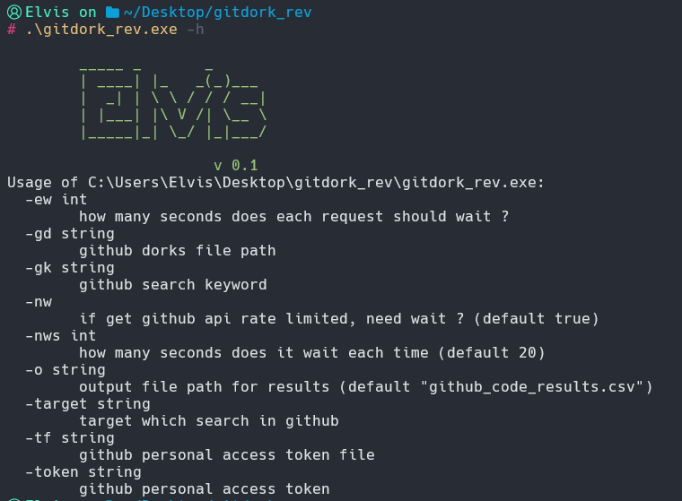

## 介绍

`gitdork_rev`是一款基于GO的自动调用github api收集敏感信息的工具，改编自 [gitdorks_go](https://github.com/obheda12/GitDorker)

由于原版无法检索到详细的信息，所以我这里增加了检索至目标文档url功能，增加了输出结果分类保存功能

## 使用

```ascii
   gitdork_rev

        _____ _       _
        | ____| |_   _(_)___
        |  _| | \ \ / / / __|
        | |___| |\ V /| \__ \
        |_____|_| \_/ |_|___/

                       v 0.1
Usage of gitdork_rev:
  -ew int
    	how many seconds does each request should wait ? 
    	# 每2个请求间隔多少秒
  -gd string
    	github dorks file path 
    	# github dorks 文件路径
  -gk string
    	github search keyword
    	# github 搜索keyword
  -nw
    	if get github api rate limited, need wait ? (default true) 
    	# 如果遇到了github速率限制，是否等待
  -nws int
    	how many seconds does it wait each time (default 10)
    	# 如果要等待，需要等待多少秒
  -o string
        output file path for results (default "github_code_results.csv")
  -target string
    	target which search in github
    	# 搜索的目标
  -tf string
    	github personal access token file
    	# github personal access token文件，一行一个
  -token string
    	github personal access token

```


```shell
gitdork_rev -gd Dorks/smalldorks.txt -nws 20 -target xxx.com -tf tokenFile/tf.txt -ew 3
```



## 安装

### 自己编译

```shell
cd gitdor_rev
bash build.sh
```

### 现成使用

```shell
cd gitdor_rev/release
./gitdor_rev_amd_linux
```


### 文件目录

```
.
├── Dorks						# 一些推荐dorks
│   ├── alldorksv3
│   ├── medium_dorks.txt
│   └── smalldorks.txt
├── README.md
├── build.sh					# 编译脚本，可以直接用release目录下的
├── go.mod
├── go.sum
├── main.go						# 主程序
├── release
│   ├── gitdor_rev.exe			# windows
│   ├── gitdor_rev_amd_linux	# linux
│   └── gitdor_rev_darwin		# mac
└── tokenFile
    └── tf.txt					# token file
```

## 参考

* [gitdorks_go](https://github.com/damit5/gitdorks_go)
